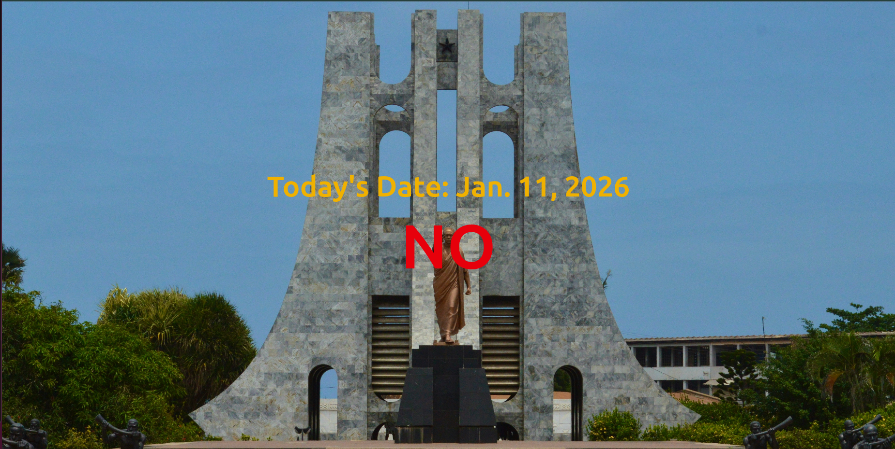

# 🇬🇭 Is It Ghana Independence Day?

A simple Django web application that displays today’s date and tells you whether it is **Ghana’s Independence Day (March 6)**.

## 📸 Screenshot

## 🧠 How It Works
- Uses Python’s `datetime` module to get today’s date
- Compares it with **March 6**
- Displays a clear **YES** or **NO** message

- 

